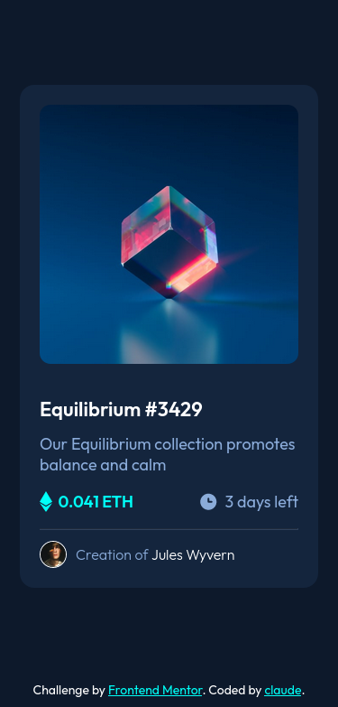
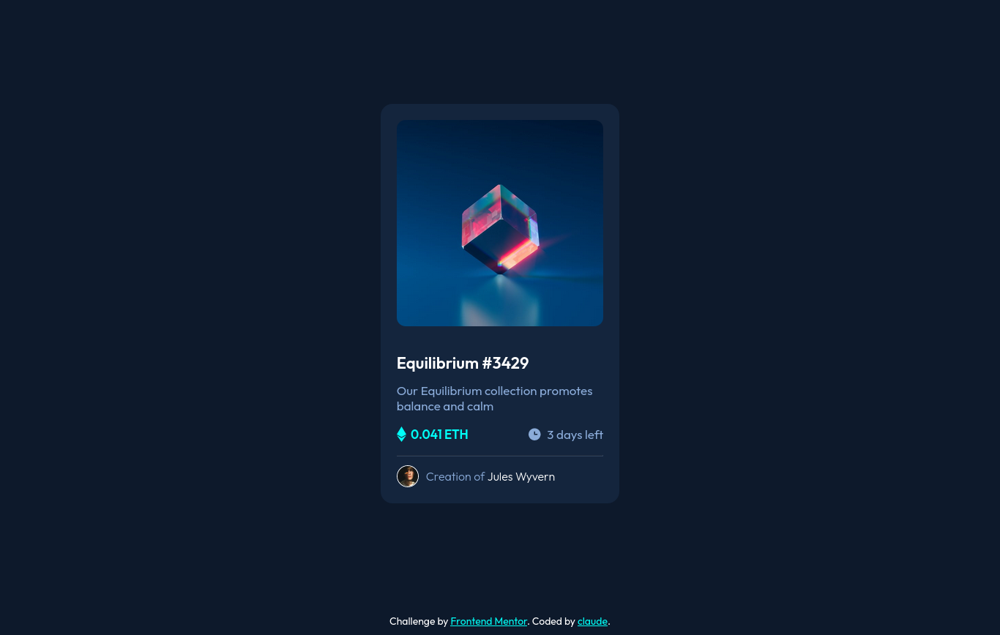

# Frontend Mentor - NFT preview card component solution

This is a solution to the [NFT preview card component challenge on Frontend Mentor](https://www.frontendmentor.io/challenges/nft-preview-card-component-SbdUL_w0U). Frontend Mentor challenges help you improve your coding skills by building realistic projects.

## Table of contents

- [Overview](#overview)
  - [The challenge](#the-challenge)
  - [Screenshot](#screenshot)
  - [Links](#links)
- [My process](#my-process)
  - [Built with](#built-with)
  - [What I learned](#what-i-learned)
  - [Continued development](#continued-development)
  - [Useful resources](#useful-resources)
- [Author](#author)
- [Acknowledgments](#acknowledgments)

## Overview

### The challenge

Users should be able to:

- View the optimal layout depending on their device's screen size
- See hover states for interactive elements

### Screenshot

### Links

- Solution URL: [Add solution URL here](https://your-solution-url.com)
- Live Site URL: [Add live site URL here](https://your-live-site-url.com)

## My process

Since only use the starter pack all the sizes are based on my observation on the design images inside the starter pack provided by Frontend Mentor.

1. Arranging the files (Nothing I just like to arrange)
2. Making the HTML structure
3. Building the design for mobile first
4. Then the Desktop view
5. Lastly the active states.
6. Some half-baked transitions 😂

### Built with

- Semantic HTML5 markup
- CSS custom properties
- Flexbox
- CSS Grid
- Mobile-first workflow

### What I learned

While building the project, I have difficulty on making the image with view icon in the active state since, I realized while using the opacity also affects the child elements

### Continued development

- Addition of design in tablet size

## Author

- Frontend Mentor - [@cla-ude](https://www.frontendmentor.io/profile/cla-ude)
